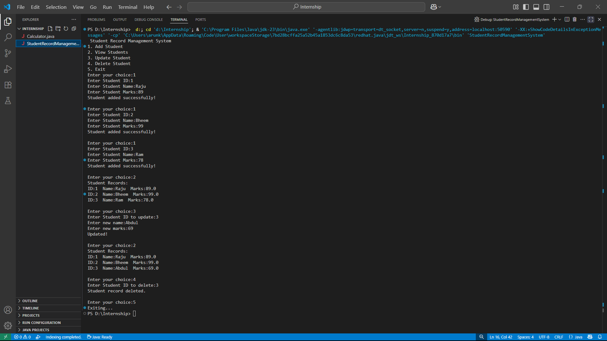

# Student Record Management System

## 📌 Description

A Java-based console application to manage student records using basic CRUD operations.

## ✅ What I Did

- Created a `Student` class with ID, name, and marks.
- Used `ArrayList` to store student data dynamically.
- Implemented menu options to Add, View, Update, and Delete student records.
- Built a clean and simple CLI using `Scanner` for user input.

## ⚙️ How It Works

1. Displays a menu with options: Add, View, Update, Delete, Exit.
2. Accepts user input for operations using Java Scanner.
3. Stores student data in memory using an `ArrayList`.
4. Repeats the menu until the user selects "Exit".

